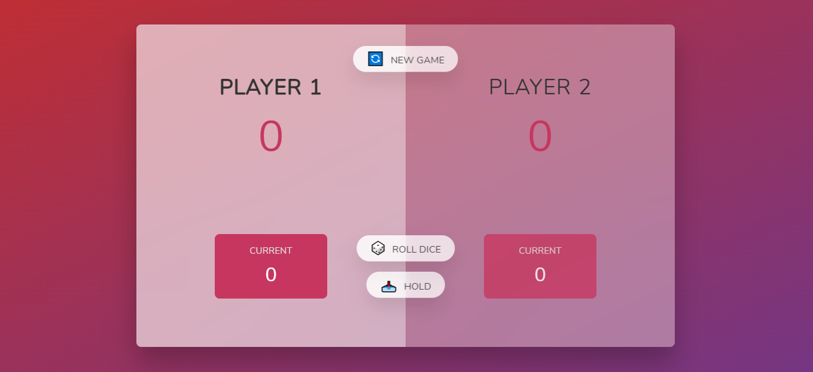

# Pig game
## Mini game developed to practice javascript skills.

- 2 player game with the purpouse of get the highest score
- the first player rolls the dice and can hold the number if its different from 1
- the first player to get the highest score wins
- the button new game starts another game

